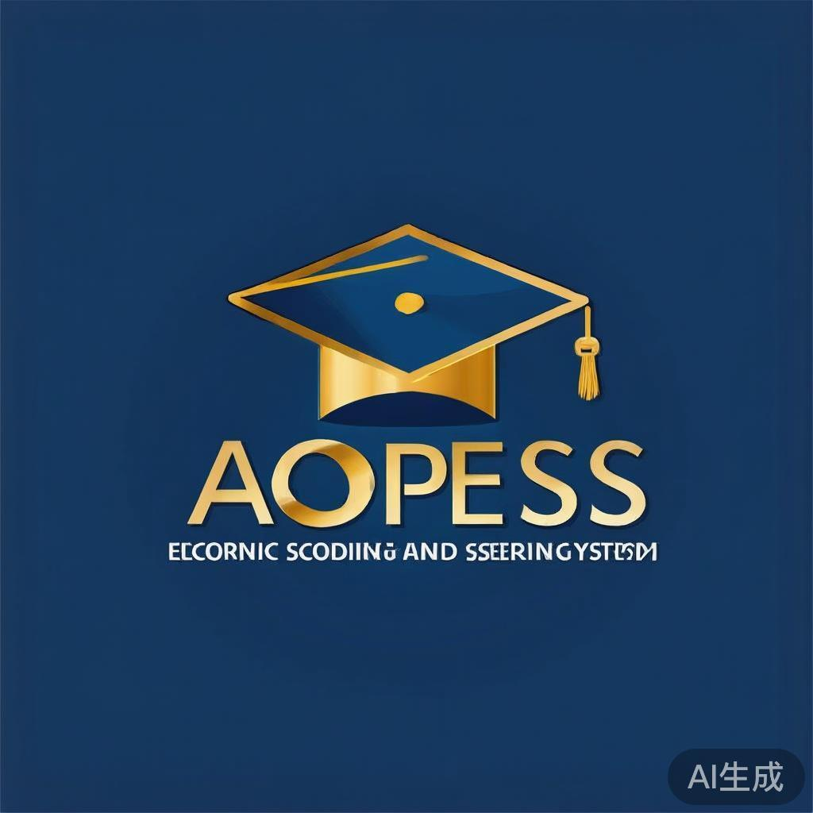

# AOPESS - Adeseun Ogundoyin Polytechnic Electronic Scoring & Screening System



## Overview

AOPESS is a comprehensive Electronic Scoring and Screening System designed specifically for Adeseun Ogundoyin Polytechnic Eruwa. This system automates the entire candidate evaluation process, from registration to final admission decisions, eliminating manual paperwork, reducing errors, and improving transparency in the institution's admission process.

## Key Features

### 🔐 **Multi-Role Authentication System**
- **Candidate Portal**: Self-service registration, login, and application management
- **Admin Portal**: System administration, program management, and user management
- **Screening Officer Portal**: Candidate evaluation and scoring interface
- **HOD Portal**: Department-level oversight and approval workflows

### 📝 **Candidate Management**
- Online registration with comprehensive data capture
- Document upload (passport photographs, O'level results)
- Application tracking and status monitoring
- Profile management and editing capabilities

### 🎯 **Automated Screening System**
- Configurable screening criteria with weighted scoring
- Real-time score calculation and validation
- Multi-criteria evaluation (Academic, Communication, Technical, Personal)
- Progress tracking and audit logging

### 📊 **Advanced Analytics & Reporting**
- Real-time dashboards with key performance metrics
- Comprehensive reporting system with multiple report types
- Data visualization and trend analysis
- Export capabilities (PDF, CSV, Excel)

### 🔍 **Advanced Search & Filtering**
- Multi-dimensional candidate search
- Advanced filtering by program, status, scores, demographics
- Bulk operations and data export
- Real-time search results

### 📱 **Responsive & Modern UI**
- Built with Next.js 15 and TypeScript
- Modern, intuitive interface using Tailwind CSS and shadcn/ui
- Mobile-responsive design for all user types
- Professional branding and user experience

## Architecture & Methodology

### System Architecture

```
┌─────────────────┐    ┌─────────────────┐    ┌─────────────────┐
│   Candidate     │    │   Admin         │    │   Screening     │
│   Portal        │    │   Portal        │    │   Officer       │
│                 │    │                 │    │   Portal        │
└─────────┬───────┘    └─────────┬───────┘    └─────────┬───────┘
          │                      │                      │
          └──────────────────────┼──────────────────────┘
                                 │
                    ┌─────────────┴─────────────┐
                    │     Authentication         │
                    │     Service Layer          │
                    └─────────────┬─────────────┘
                                  │
                    ┌─────────────┴─────────────┐
                    │      Business Logic        │
                    │      (API Endpoints)       │
                    └─────────────┬─────────────┘
                                  │
                    ┌─────────────┴─────────────┐
                    │      Data Access Layer     │
                    │      (Prisma ORM)          │
                    └─────────────┬─────────────┘
                                  │
                    ┌─────────────┴─────────────┐
                    │     Database (SQLite)      │
                    │     + File Storage        │
                    └───────────────────────────┘
```

### Technology Stack

#### Frontend
- **Framework**: Next.js 15 with App Router
- **Language**: TypeScript 5
- **Styling**: Tailwind CSS 4
- **UI Components**: shadcn/ui (New York style)
- **Icons**: Lucide React
- **Forms**: React Hook Form with Zod validation
- **State Management**: Zustand for client state, TanStack Query for server state
- **Notifications**: SweetAlert2 for user alerts

#### Backend
- **Runtime**: Node.js with Next.js API Routes
- **Database**: SQLite with Prisma ORM
- **Authentication**: Role-based access control
- **File Upload**: Multer for document handling
- **Validation**: Zod schemas for data validation
- **Security**: Input sanitization, SQL injection prevention

#### Development Tools
- **Package Manager**: npm
- **Code Quality**: ESLint with Next.js rules
- **Database Management**: Prisma Studio
- **Development Server**: Nodemon with hot reload

## Database Schema

### Core Entities

#### Candidates
```sql
- id (Primary Key)
- applicationNumber (Unique)
- firstName, lastName, middleName
- email, phone (Unique)
- dateOfBirth, gender
- address, lga, state, country
- utmeScore
- olevelResults (JSON)
- passportPhoto (URL)
- programId (Foreign Key)
- screeningStatus (Enum)
- totalScore
- remarks
- createdAt, updatedAt
```

#### Programs
```sql
- id (Primary Key)
- name, code (Unique)
- department, faculty
- duration, capacity
- utmeCutOffMark
- olevelRequirements (JSON)
- isActive (Boolean)
- createdAt, updatedAt
```

#### Screening Criteria
```sql
- id (Primary Key)
- name, description
- maxScore, weight
- programId (Foreign Key)
- isActive (Boolean)
- createdAt, updatedAt
```

#### Screening Results
```sql
- id (Primary Key)
- candidateId (Foreign Key)
- criteriaId (Foreign Key)
- score, remarks
- screenedBy
- screenedAt
- createdAt, updatedAt
```

#### Admin Users
```sql
- id (Primary Key)
- email, password (Unique)
- name, role (Enum)
- department, isActive
- lastLoginAt
- createdAt, updatedAt
```

#### Audit Logs
```sql
- id (Primary Key)
- action, description
- entityType, entityId
- performedBy (Foreign Key)
- oldValues, newValues (JSON)
- ipAddress, userAgent
- createdAt
```

### Relationships
- **Programs** → **Candidates** (One-to-Many)
- **Programs** → **Screening Criteria** (One-to-Many)
- **Candidates** → **Screening Results** (One-to-Many)
- **Screening Criteria** → **Screening Results** (One-to-Many)
- **Admin Users** → **Audit Logs** (One-to-Many)

## Installation & Setup

### Prerequisites
- Node.js 18+ 
- npm or yarn
- SQLite3

### Step 1: Clone the Repository
```bash
git clone <repository-url>
cd aopess-electronic-scoring-system
```

### Step 2: Install Dependencies
```bash
npm install
```

### Step 3: Set Up Database
```bash
# Generate Prisma client
npm run db:generate

# Push schema to database
npm run db:push
```

### Step 4: Configure Environment Variables
Create a `.env` file in the root directory:
```env
DATABASE_URL="file:./dev.db"
NEXTAUTH_URL="http://localhost:3000"
NEXTAUTH_SECRET="your-secret-key"
```

### Step 5: Run Development Server
```bash
npm run dev
```

The application will be available at `http://localhost:3000`

## Usage Guide

### For Candidates

#### 1. Registration
1. Visit `/auth/register`
2. Fill out the registration form with:
   - Personal information (name, email, phone, date of birth)
   - Contact details (address, LGA, state)
   - Academic information (UTME score, O'level results)
   - Program selection
   - Account credentials
3. Upload passport photograph
4. Submit registration

#### 2. Login
1. Visit `/auth/login`
2. Select "Candidate" role
3. Enter email and password
4. Access candidate dashboard

#### 3. Dashboard Features
- **View Profile**: Review personal and academic information
- **Edit Profile**: Update personal details
- **Start Screening**: Begin assessment when available
- **View Report**: Check screening results and admission status

### For Administrators

#### 1. Login
1. Visit `/auth/login`
2. Select "Administrator" role
3. Enter admin credentials

#### 2. Admin Portal Features
- **Program Management**: Add, edit, and manage academic programs
- **User Management**: Manage admin and officer accounts
- **System Configuration**: Configure screening criteria and settings
- **Analytics Dashboard**: View system-wide statistics and reports

### For Screening Officers

#### 1. Login
1. Visit `/auth/login`
2. Select "Screening Officer" role
3. Enter officer credentials

#### 2. Screening Portal Features
- **Candidate Queue**: View candidates awaiting screening
- **Screening Interface**: Evaluate candidates using defined criteria
- **Score Management**: Assign scores and provide feedback
- **Progress Tracking**: Monitor screening completion rates

### For Heads of Department

#### 1. Login
1. Visit `/auth/login`
2. Select "Head of Department" role
3. Enter HOD credentials

#### 2. HOD Portal Features
- **Department Overview**: View department-specific statistics
- **Approval Workflows**: Review and approve screening results
- **Quality Assurance**: Monitor screening standards and consistency
- **Departmental Reports**: Generate department-level analytics

## API Documentation

### Authentication Endpoints

#### POST /api/auth/login
```json
{
  "email": "user@example.com",
  "password": "password123",
  "role": "CANDIDATE"
}
```

#### POST /api/auth/register
```json
{
  "firstName": "John",
  "lastName": "Doe",
  "email": "john.doe@example.com",
  "password": "password123",
  "programId": "program_id",
  "utmeScore": 280,
  "olevelResults": "Mathematics: B2, English: B3, Physics: A1"
}
```

### Candidate Endpoints

#### GET /api/candidates
Retrieve all candidates with filtering and pagination

#### GET /api/candidates/[id]
Retrieve specific candidate details

#### PUT /api/candidates/[id]
Update candidate information

#### DELETE /api/candidates/[id]
Delete candidate record

### Program Endpoints

#### GET /api/programs
Retrieve all programs

#### POST /api/programs
Create new program

#### PUT /api/programs/[id]
Update program details

#### DELETE /api/programs/[id]
Delete program

### Screening Endpoints

#### GET /api/screening/candidates
Get candidates in screening queue

#### POST /api/screening/evaluate
Submit screening evaluation
```json
{
  "candidateId": "candidate_id",
  "scores": [
    {
      "criteriaId": "criteria_id",
      "score": 85,
      "remarks": "Excellent performance"
    }
  ],
  "overallRemarks": "Strong candidate recommended for admission"
}
```

#### GET /api/screening/results/[candidateId]
Get screening results for candidate

### Report Endpoints

#### GET /api/reports/summary
Generate summary report

#### GET /api/reports/candidates
Generate candidate list report

#### GET /api/reports/screening
Generate screening results report

#### GET /api/reports/analytics
Generate analytics report

## Security Features

### Authentication & Authorization
- Role-based access control (RBAC)
- Session management with secure cookies
- Password hashing with bcrypt
- Input validation and sanitization

### Data Protection
- SQL injection prevention with parameterized queries
- XSS protection with proper input escaping
- CSRF protection for form submissions
- Secure file upload handling

### Audit Trail
- Comprehensive logging of all system actions
- User activity tracking
- Data change history
- IP address and user agent logging

## Testing

### Unit Tests
```bash
npm run test:unit
```

### Integration Tests
```bash
npm run test:integration
```

### End-to-End Tests
```bash
npm run test:e2e
```

## Deployment

### Production Build
```bash
npm run build
npm start
```

### Environment Configuration
Production environment variables:
```env
DATABASE_URL="production_database_url"
NEXTAUTH_URL="https://your-domain.com"
NEXTAUTH_SECRET="production-secret-key"
NODE_ENV="production"
```

### Database Migration
```bash
npm run db:migrate
```

## Contributing

### Development Guidelines
1. Follow TypeScript best practices
2. Use ESLint configuration for code quality
3. Write meaningful commit messages
4. Create pull requests for new features
5. Update documentation for changes

### Code Style
- Use TypeScript strict mode
- Follow ESLint rules
- Use Prettier for formatting
- Write component documentation
- Implement proper error handling

## Troubleshooting

### Common Issues

#### Database Connection Errors
```bash
# Check database file permissions
ls -la prisma/dev.db

# Reset database if needed
npm run db:reset
```

#### Build Errors
```bash
# Clear Next.js cache
rm -rf .next
npm run build
```

#### Authentication Issues
```bash
# Clear browser cookies and localStorage
# Check environment variables
# Verify database schema
```

## Support

### Contact Information
- **Technical Support**: support@aopess.edu.ng
- **Administrative Support**: admin@aopeess.edu.ng
- **Documentation**: docs.aopess.edu.ng

### Help Resources
- [User Manual](./docs/user-manual.md)
- [Technical Documentation](./docs/technical-docs.md)
- [API Reference](./docs/api-reference.md)
- [FAQ](./docs/faq.md)

## License

This project is licensed under the MIT License - see the [LICENSE](LICENSE) file for details.

## Acknowledgments

- **Adeseun Ogundoyin Polytechnic Eruwa** - For the opportunity to develop this system
- **ICT Department** - For technical support and infrastructure
- **Admissions Office** - For requirements gathering and testing
- **Academic Departments** - For domain expertise and validation

---

